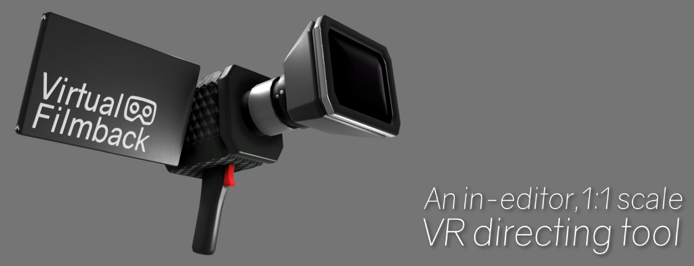

This Unity package allows you to instance yourself into your Unity scene and record camera movements in a more precise, true-to-life fashion. Convenient for high end real-time rendering and game cutscenes alike - No more intermittent mashing of *GameObject/Align With View* to key camera position.

As this package contains only the camera prefab and not a full-locomotion system (for now), this package can also be installed on top of any project with pre-installed VR integration (so that you can devise your own long range movement schemes, whether it be Cloverfield-esque foot movement or dolly translations).

### Control Scheme
Controls are one-handed and mirrored, ultimately you can only hold one controller if you wish to do so but you can still hold the camera with one hand and control playback and recording with the other.

#### Oculus Touch
- Index trigger button: Hold to record.
- B / Y buttons: Play & pause current timeline.
- A / X buttons: Snap back to original FOV.
- Joystick, horizontally: Zoom in and out.

### Workflow

- If you are left-handed, mark the checkbox as such - this will adjust the position of the camera viewport for you (yes, I only made this because I'm left handed myself).
- Assign a playable director in your scene to the playable director slot - you'll be able to pause and play your Timeline to give yourself some time to reposition yourself between shots.
- Set the inital field of view for your camera (50-55 is a good setting for film 7 TV but you can increase it higher if you're recording cutscenes for a skateboard game) - After zooming in and out while recording you'll be able to easily snap back to this preset FOV.

### Dependencies & Requirements
- Unity 2019.1 or later
- Have "Virtual Reality Supported" enabled in your XR Settings for that Unity Project.
- Package Manager Version of the Unity Recorder
- A VR headset with motion controllers (Tested on Oculus Rift CV1, ought to work with the HTC Vive + Wands and maybe with WMR headsets)

### Install process

This is a plugin that makes use of Unity's new *Package Manager* feature. Just drop the *com.alexismorin.virtualfilmback* folder into your *packages* folder (found at the same level as your Assets folder) and it should work out-of-the-box. If you're using an older version of Unity (not supported here, but can be made to work if you're courageous), take the *com.alexismorin.virtualfilmback* folder and then drag it anywhere into your regular project hierarchy.

### Todo
- Add input schemes for more VR devices
- Dolly-like movement scheme to increase possible recording range.
- On-foot movement scheme to increase possible recording range.
- Flying movement scheme to increase possible recording range.
- Better compatibility with non-Oculus headsets.

Try and enjot in spite of all the bugs!

Crafted at [Imaginary Spaces](https://imaginary-spaces.com/) while waiting for other packages to import.